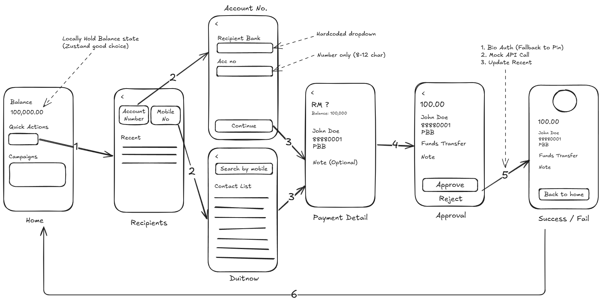

## Secure Payment Transfer App (React Native)

A digital banking prototype built with **React Native** and **TypeScript**. This module demonstrates secure payment transfers with **biometric authentication**, **PIN fallback**, **mocked API calls**, and **contact-based recipient selection**.



### Demo Video

[Biometric Flow Demo](https://youtube.com/shorts/yaKB6ePTBe8)

[Fallback Flow Demo](https://youtube.com/shorts/AH2BeC2dICc)

---

## 🔧 Setup Instructions

> ⚠️ Tested on **Android only**. iOS support is not configured.

### 1. Install Dependencies

```bash
yarn install
# or
npm install
```

### 2. Start Metro Bundler

```bash
yarn start
# or
npx react-native start
```

### 3. Run on Android

```bash
yarn android
# or
npx react-native run-android
```

### 4. (Optional) Clean Build Cache

```bash
cd android && ./gradlew clean && cd ..
```

---

## ✅ Features

### 1. **Payment Transfer Interface**

- User-friendly input for:

  - Recipient selection (manual or contact)
  - Amount (currency-formatted)
  - Optional note

- Displays current account balance
- Validates inputs with meaningful error messages

### 2. **Biometric Authentication**

- Prompts biometric authentication (Face ID / Fingerprint) **before transfer**
- If biometric fails or is unsupported, prompts **custom PIN input**
- Blocks transfers until authentication succeeds or explicitly fails

### 3. **Transaction Processing**

- Simulated API call after successful authentication
- Introduces **20% chance of network failure** to simulate real-world issues
- Displays result screen showing success or failure with message

### 4. **Performance Optimization**

- Uses `FlatList` for efficient list rendering
- State managed with **Zustand** for minimal re-renders

### 5. **Recipient Management**

- Recent transfer list (in-memory only)
- Access device contacts (with permission) for recipient selection
- Hardcoded bank options
- Automatically resolves account number to a name (e.g. **John Doe**, or contact name)

---

## ⚙️ Assumptions & Concerns

- **Balance is reset** on app restart (not persisted)
- **API mock occurs _after_ biometric authentication**
- **Bank list is hardcoded**
- Recipient name is fetched from account number or contact
- Real-world BE scenario need to handle idempotency to resolve double tap issue
- PIN fallback should use custom keypad for security purpose

---

## ⚠️ Known Limitations

- iOS build not configured or tested
- Contacts access requires permission and may fail on emulator
- App does not persist state to storage (i.e. balance and history are volatile)
- Only simulates backend behavior (no real API or database)

---
